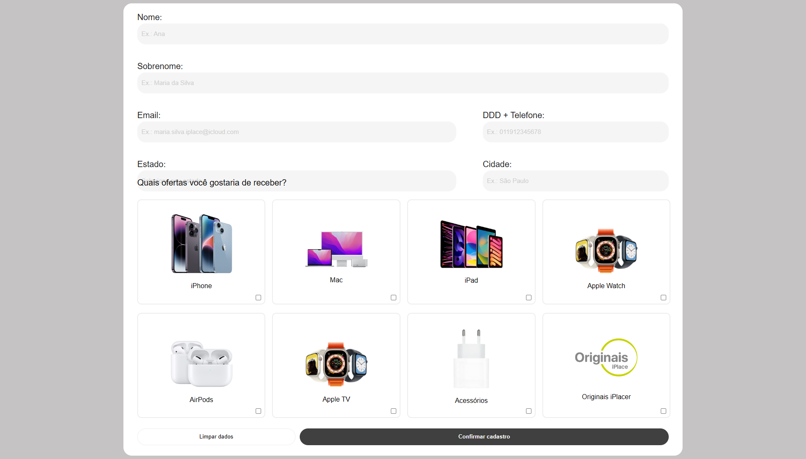

# 📝 LeadSync - Formulário de Captação de Leads



## 📌 Descrição

**LeadSync** é um projeto acadêmico desenvolvido como parte da disciplina de **Desenvolvimento Web II**, com o objetivo de aplicar e praticar os conhecimentos em **HTML5**, **CSS3** e introdução ao **JavaScript**.

O projeto simula um formulário de captação de leads, com um layout visual que permite aos usuários selecionar os tipos de ofertas que desejam receber, como iPhone, Mac, iPad, entre outros produtos Apple.

## 🔗 Acesse o projeto

Você pode acessar a versão online do projeto aqui:  
👉 [Ver Projeto no Navegador](https://nnathalia.github.io/LeadSync/)

## 🎯 Objetivo Educacional

- Aplicar conceitos de **formulários HTML**.
- Utilizar **CSS Flexbox e Grid** para layout responsivo.
- Trabalhar com **estilização de inputs, botões e imagens**.
- Praticar organização de projetos com estrutura de pastas.
- Integrar interatividade com **JavaScript** puro.

## 💡 Funcionalidades

- Campos de entrada para nome, sobrenome, email, telefone, estado e cidade.
- Seleção visual de produtos por meio de checkboxes com imagens.
- Botão para limpar o formulário.
- Botão para simular o envio dos dados.
- Destaque visual (classe `card-check`) nos cards dos produtos selecionados.

## ⚙️ Interatividade com JavaScript

O projeto conta com um script que adiciona uma classe ao card correspondente quando o checkbox é marcado, permitindo aplicar um estilo visual diferenciado.

### Exemplo de comportamento:
```js
function toggleCardSelection(event) {
  const checkbox = event.target;
  const card = checkbox.closest('.card-img');

  if (card) {
    card.classList.toggle('card-check');
  }
}

document.querySelectorAll('.checkbox').forEach(checkbox => {
  checkbox.addEventListener('click', toggleCardSelection);
});
```

Essa lógica torna a interface mais intuitiva e interativa para o usuário.

## 🖼️ Interface Visual

A galeria utiliza imagens SVG para representar os seguintes produtos:

- `iphone.svg`
- `mac.svg`
- `ipad.svg`
- `apple_watch.svg`
- `airPods.svg`
- `appleTv.svg`
- `acessorios.svg`
- `originaisIPlace.svg`

## 📁 Estrutura de Pastas

```
LeadSync/
├── index.html
├── assets/
│   ├── css/
│   │   └── style.css
│   ├── js/
│   │   └── script.js
│   └── img/
│       ├── iphone.svg
│       ├── mac.svg
│       ├── ipad.svg
│       ├── apple_watch.svg
│       ├── airPods.svg
│       ├── appleTv.svg
│       ├── acessorios.svg
│       └── originaisIPlace.svg
```

## 🚀 Tecnologias Utilizadas

- **HTML5** — estrutura semântica da página.
- **CSS3** — estilização, responsividade e identidade visual.
- **JavaScript** — interatividade com elementos da página.

## ✅ Como usar

1. Clone ou baixe este repositório:
   ```bash
   git clone https://github.com/seu-usuario/LeadSync.git
   ```
2. Navegue até a pasta do projeto:
   ```bash
   cd LeadSync
   ```
3. Abra o arquivo `index.html` no navegador.

## 📚 Contexto Acadêmico

Este projeto foi desenvolvido como parte da disciplina **Desenvolvimento Web II**, com o propósito de reforçar o aprendizado de HTML, CSS e lógica básica com JavaScript. Ele é de uso exclusivamente educacional.

## 🔖 Licença

Uso livre para fins de estudo.
